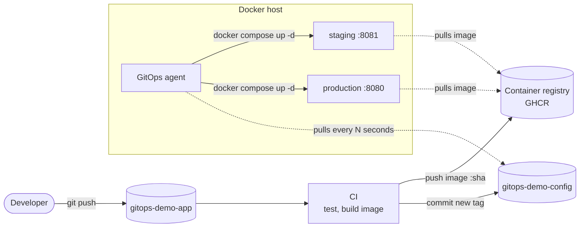

# gitops-demo-app

A deliberately tiny Flask app used to show a GitOps pipeline on plain Docker. The app is
not the point: one container, three endpoints, and everything interesting happens around it.

- `GET /` a page showing the environment, the commit it was built from and a message
- `GET /health` liveness, also used as the container healthcheck
- `GET /version` the same build info as JSON

## Architecture



Two repositories, on purpose:

| Repo | Holds | Changes when |
|---|---|---|
| `gitops-demo-app` (this one) | source, Dockerfile, CI | the code changes |
| [`gitops-demo-config`](../gitops-demo-config) | the desired state of every environment, plus the agent | a release is promoted, a setting changes, something is rolled back |

CI never talks to the Docker host. It builds an image, pushes it, and writes the new tag
into the config repo. A small agent on the host pulls that repo and makes the running
containers match it. Deploying, promoting and rolling back are all just commits.

## CI

`.github/workflows/ci.yml`

| Job | Runs on | What it does |
|---|---|---|
| `test` | every push and PR | installs dependencies and runs pytest |
| `image` | every push and PR | builds the image; on `main` also pushes `ghcr.io/<repo>:<short-sha>` |
| `update-config` | `main` only | sets `IMAGE_TAG` for staging in the config repo and pushes that commit |

Tags are the short commit sha, so an image is immutable and traceable to its source.
Production is never touched here: it is promoted from the config repo.

### GitHub setup

- A `CONFIG_REPO_TOKEN` secret: a fine-grained token with *Contents: read and write* on `gitops-demo-config`.
- The `ghcr.io/<owner>/gitops-demo-app` package must be readable by the Docker host
  (make it public, or run `docker login ghcr.io` on the host).

## Run it

```sh
make test     # pytest in a local venv
make build    # docker image tagged with the current commit
make run      # serve on http://localhost:8000
```

### The whole pipeline offline

No GitHub needed. A local registry stands in for GHCR and a bare git repo stands in for the
config repo. From `gitops-demo-config`:

```sh
make up                              # registry, git remote and the agent
```

then here:

```sh
scripts/ci-local.sh                  # test, build, push, record the tag in the config repo
```

Within a few seconds the agent notices the new commit and staging serves the new build on
http://localhost:8081. See the config repo README for promotion, rollback and drift.
